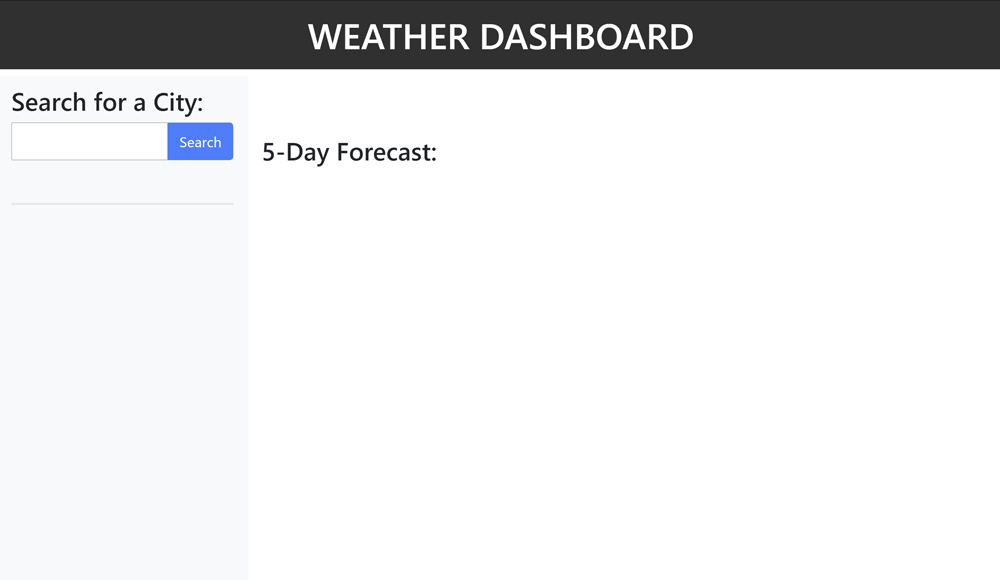

# 06 Server-Side APIs: Weather Dashboard

## Objective
Create a weather dashboard using the [OpenWeather API](https://openweathermap.org/api) to retrieve weather data for cities.

When I search for a city, I will be presented with today's date, current weather condition and the next 5 days' weather forecast. The current weather will tell me the UV index with colors that indicate whether the confitions are favortable, mderate, or severe. My searched city will be saved into my local storage so I can view it again without having to search for it when I open my browser the next time. 

## Mock-Up

## Links to the deployed applocation
[GitHub Repository](https://github.com/hanhle1989/api-weather-dashboard)
and [Deployed Application](https://hanhle1989.github.io/api-weather-dashboard/)

## Copyright (c) 2021 Hanh Le
Permission is hereby granted, free of charge, to any person obtaining a copy of this software and associated documentation files (the "Software"), to deal in the Software without restriction, including without limitation the rights to use, copy, modify, merge, publish, distribute, sublicense, and/or sell copies of the Software, and to permit persons to whom the Software is furnished to do so, subject to the following conditions:

The above copyright notice and this permission notice shall be included in all copies or substantial portions of the Software.

THE SOFTWARE IS PROVIDED "AS IS", WITHOUT WARRANTY OF ANY KIND, EXPRESS OR IMPLIED, INCLUDING BUT NOT LIMITED TO THE WARRANTIES OF MERCHANTABILITY, FITNESS FOR A PARTICULAR PURPOSE AND NONINFRINGEMENT. IN NO EVENT SHALL THE AUTHORS OR COPYRIGHT HOLDERS BE LIABLE FOR ANY CLAIM, DAMAGES OR OTHER LIABILITY, WHETHER IN AN ACTION OF CONTRACT, TORT OR OTHERWISE, ARISING FROM, OUT OF OR IN CONNECTION WITH THE SOFTWARE OR THE USE OR OTHER DEALINGS IN THE SOFTWARE.